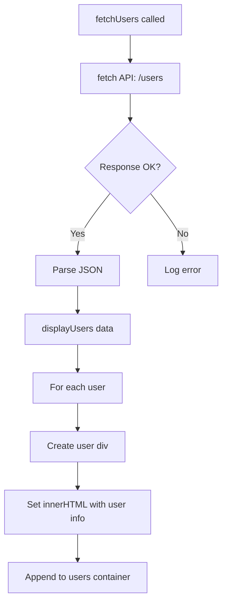

# API Flowchart

```mermaid
flowchart TD
    A[fetchUsers called] --> B[fetch API: /users]
    B --> C{Response OK?}
    C -- Yes --> D[Parse JSON]
    D --> E[displayUsers data]
    C -- No --> F[Log error]
    E --> G[For each user]
    G --> H[Create user div]
    H --> I[Set innerHTML with user info]
    I --> J[Append to users container]
```
