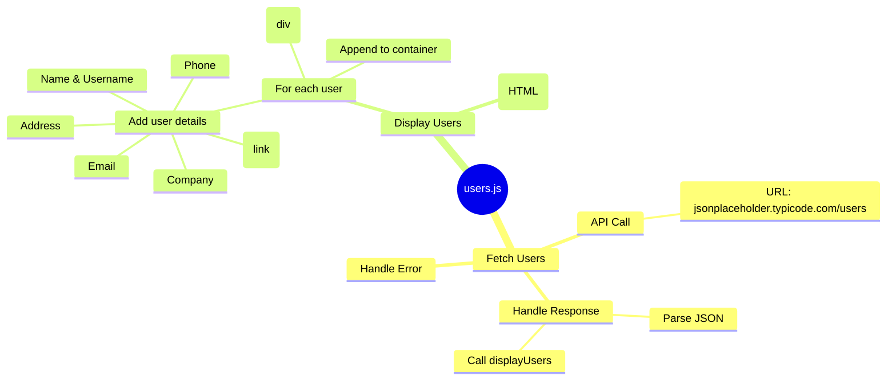

# API Mindmap Diagram

```mermaid
mindmap
  root((users.js))
    Fetch Users
      API Call
        URL: jsonplaceholder.typicode.com/users
      Handle Response
        Parse JSON
        Call displayUsers
      Handle Error
    Display Users
      Get users container (HTML)
      For each user
        Create user element (div)
        Add user details
          Name & Username
          Email
          Phone
          Website (link)
          Company
          Address
        Append to container
```
