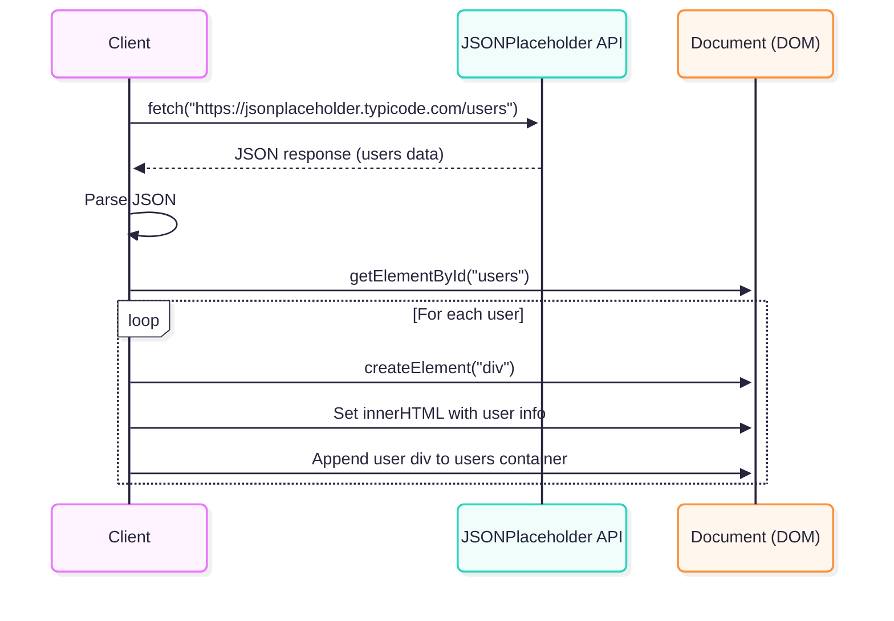

# API Sequence Diagram

```mermaid
---
config:
  theme: redux-color
  look: neo
---
sequenceDiagram
    participant Client
    participant API as JSONPlaceholder API
    participant DOM as Document (DOM)

    Client->>API: fetch("https://jsonplaceholder.typicode.com/users")
    API-->>Client: JSON response (users data)
    Client->>Client: Parse JSON
    Client->>DOM: getElementById("users")
    loop For each user
        Client->>DOM: createElement("div")
        Client->>DOM: Set innerHTML with user info
        Client->>DOM: Append user div to users container
    end
```
