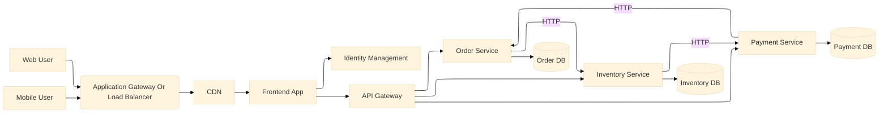

# Microservices Http Calls

```mermaid
---
config:
  theme: base
  look: classic
  layout: elk
---
flowchart LR
    %% Users
    A1[Web User] --> A2(Application Gateway Or Load Balancer)
    B1[Mobile User] --> A2

    %% CDN and Frontend
    A2 --> C1[CDN]
    C1 --> C2[Frontend App]

    %% Identity and Auth
    C2 --> D1[Identity Management]

    %% API Gateway
    C2 --> D2[API Gateway]

    %% Microservices
    D2 --> E1[Order Service]
    D2 --> E2[Inventory Service]
    D2 --> E3[Payment Service]

    %% Databases
    E1 --> F1[(Order DB)]
    E2 --> F2[(Inventory DB)]
    E3 --> F3[(Payment DB)]

    %% Inter-service HTTP communication
    E1 -->|HTTP| E2
    E2 -->|HTTP| E3
    E3 -->|HTTP| E1
```
