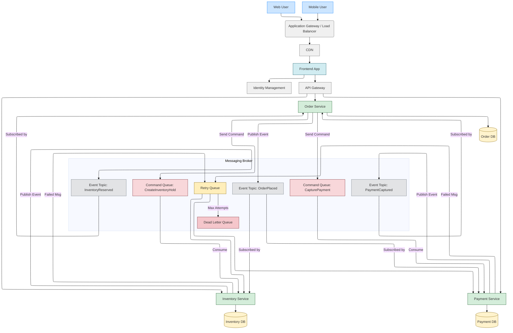

# Microservices Message Broker

```mermaid
---
config:
  theme: base
  look: classic
  layout: elk
---
flowchart TD
    %% User Access Layer
    A1[Web User]:::user --> A2(Application Gateway / Load Balancer):::infra
    B1[Mobile User]:::user --> A2
    A2 --> C1[CDN]:::infra
    C1 --> C2[Frontend App]:::frontend
    C2 --> D1[Identity Management]:::infra
    C2 --> D2[API Gateway]:::infra

    %% Microservices
    D2 --> OS[Order Service]:::service
    D2 --> IS[Inventory Service]:::service
    D2 --> PS[Payment Service]:::service

    %% Databases
    OS --> ODB[(Order DB)]:::db
    IS --> IDB[(Inventory DB)]:::db
    PS --> PDB[(Payment DB)]:::db

    %% Messaging Infrastructure
    subgraph Messaging Broker
        CMDQ1[Command Queue: CreateInventoryHold]:::command
        CMDQ2[Command Queue: CapturePayment]:::command
        EVTQ1[Event Topic: OrderPlaced]:::event
        EVTQ2[Event Topic: InventoryReserved]:::event
        EVTQ3[Event Topic: PaymentCaptured]:::event
        RETRYQ[Retry Queue]:::retry
        DLQ[Dead Letter Queue]:::dlq
    end

    %% Command Flow
    OS -- Send Command --> CMDQ1
    CMDQ1 -- Consume --> IS

    OS -- Send Command --> CMDQ2
    CMDQ2 -- Consume --> PS

    %% Event Flow
    OS -- Publish Event --> EVTQ1
    IS -- Publish Event --> EVTQ2
    PS -- Publish Event --> EVTQ3

    %% Subscriptions
    EVTQ1 -- Subscribed by --> IS
    EVTQ1 -- Subscribed by --> PS
    EVTQ2 -- Subscribed by --> OS
    EVTQ3 -- Subscribed by --> OS

    %% Retry and DLQ Handling
    IS -- Failed Msg --> RETRYQ
    RETRYQ --> IS

    PS -- Failed Msg --> RETRYQ
    RETRYQ --> PS

    RETRYQ -- Max Attempts --> DLQ

    %% Styles
    classDef user fill:#cce5ff,stroke:#007bff,stroke-width:1px;
    classDef frontend fill:#d1ecf1,stroke:#0c5460,stroke-width:1px;
    classDef service fill:#d4edda,stroke:#155724,stroke-width:1px;
    classDef db fill:#fff3cd,stroke:#856404,stroke-width:1px;
    classDef command fill:#f8d7da,stroke:#721c24,stroke-width:1px;
    classDef event fill:#e2e3e5,stroke:#6c757d,stroke-width:1px;
    classDef retry fill:#ffeeba,stroke:#856404,stroke-width:1px;
    classDef dlq fill:#f5c6cb,stroke:#721c24,stroke-width:1px;
    classDef infra fill:#f0f0f0,stroke:#666,stroke-width:1px;
```
