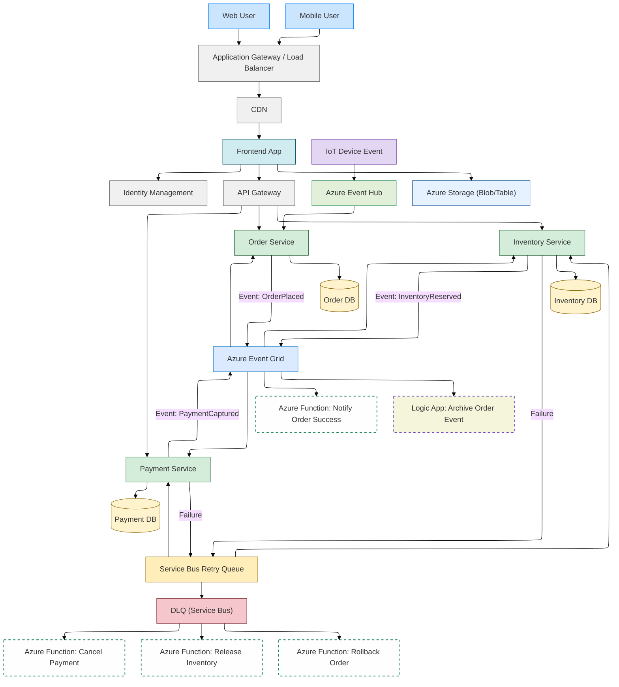

# Microservices Saga Choreography - Detail

```mermaid
---
config:
  theme: base
  look: classic
  layout: elk
---
flowchart TD
    %% Node Declarations First

    %% Users
    A1["Web User"]:::user
    B1["Mobile User"]:::user
    A2["Application Gateway / Load Balancer"]:::infra
    C1["CDN"]:::infra
    C2["Frontend App"]:::frontend
    D1["Identity Management"]:::infra
    D2["API Gateway"]:::infra

    %% Microservices
    OS["Order Service"]:::service
    IS["Inventory Service"]:::service
    PS["Payment Service"]:::service

    %% Databases
    ODB["Order DB"]:::db
    IDB["Inventory DB"]:::db
    PDB["Payment DB"]:::db

    %% Azure Messaging
    EVG["Azure Event Grid"]:::eventgrid
    SBQ["Service Bus Retry Queue"]:::servicebus
    DLQ["DLQ (Service Bus)"]:::dlq

    %% Compensation Handlers
    CF1["Azure Function: Cancel Payment"]:::function
    CF2["Azure Function: Release Inventory"]:::function
    CF3["Azure Function: Rollback Order"]:::function

    %% Azure Event Handlers
    AF1["Azure Function: Notify Order Success"]:::function
    LA1["Logic App: Archive Order Event"]:::logicapp

    %% Additional Services
    IOT["IoT Device Event"]:::iot
    EH["Azure Event Hub"]:::eventhub
    AZS["Azure Storage (Blob/Table)"]:::storage

    %% Connections

    A1 --> A2
    B1 --> A2
    A2 --> C1
    C1 --> C2
    C2 --> D1
    C2 --> D2
    D2 --> OS
    D2 --> IS
    D2 --> PS

    %% Databases
    OS --> ODB[(Order DB)]
    IS --> IDB[(Inventory DB)]
    PS --> PDB[(Payment DB)]

    %% Event Grid Saga Flow
    OS -- "Event: OrderPlaced" --> EVG
    EVG --> IS
    IS -- "Event: InventoryReserved" --> EVG
    EVG --> PS
    PS -- "Event: PaymentCaptured" --> EVG
    EVG --> OS

    %% Azure Event Handlers
    EVG --> AF1
    EVG --> LA1

    %% Retry and DLQ
    IS -- "Failure" --> SBQ
    PS -- "Failure" --> SBQ
    SBQ --> IS
    SBQ --> PS
    SBQ --> DLQ

    %% Compensation Actions
    DLQ --> CF1
    DLQ --> CF2
    DLQ --> CF3

    %% IoT + Storage
    IOT --> EH --> OS
    C2 --> AZS

    %% Styles
    classDef user fill:#cce5ff,stroke:#007bff,stroke-width:1px;
    classDef frontend fill:#d1ecf1,stroke:#0c5460,stroke-width:1px;
    classDef service fill:#d4edda,stroke:#155724,stroke-width:1px;
    classDef db fill:#fff3cd,stroke:#856404,stroke-width:1px;
    classDef eventgrid fill:#dbeaff,stroke:#0072c6,stroke-width:1px;
    classDef eventhub fill:#e2f0d9,stroke:#1e8449,stroke-width:1px;
    classDef servicebus fill:#ffeeba,stroke:#856404,stroke-width:1px;
    classDef dlq fill:#f5c6cb,stroke:#721c24,stroke-width:1px;
    classDef storage fill:#e6f2ff,stroke:#004085,stroke-width:1px;
    classDef iot fill:#e2d6f3,stroke:#5f259f,stroke-width:1px;
    classDef infra fill:#f0f0f0,stroke:#666,stroke-width:1px;
    classDef function fill:#fefefe,stroke:#198754,stroke-width:1.5px,stroke-dasharray: 5;
    classDef logicapp fill:#f5f5dc,stroke:#6f42c1,stroke-width:1.5px,stroke-dasharray: 5;
```
