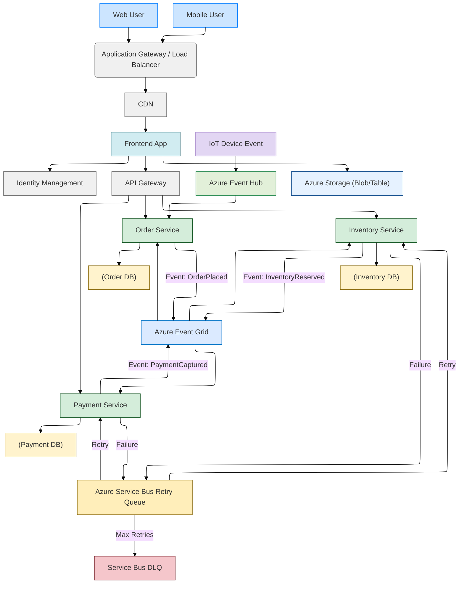

# Microservices Saga Choreography - Simple

```mermaid
---
config:
  theme: base
  look: classic
  layout: elk
---
flowchart TD
    %% Users & Access
    A1["Web User"]:::user --> A2(Application Gateway / Load Balancer):::infra
    B1["Mobile User"]:::user --> A2
    A2 --> C1["CDN"]:::infra
    C1 --> C2["Frontend App"]:::frontend
    C2 --> D1["Identity Management"]:::infra
    C2 --> D2["API Gateway"]:::infra

    %% Microservices (Saga Participants)
    D2 --> OS["Order Service"]:::service
    D2 --> IS["Inventory Service"]:::service
    D2 --> PS["Payment Service"]:::service

    %% Databases
    OS --> ODB["(Order DB)"]:::db
    IS --> IDB["(Inventory DB)"]:::db
    PS --> PDB["(Payment DB)"]:::db

    %% Saga Event Flow (Choreography using Event Grid)
    OS -- Event: OrderPlaced --> EVG["Azure Event Grid"]:::eventgrid
    EVG --> IS
    IS -- Event: InventoryReserved --> EVG
    EVG --> PS
    PS -- Event: PaymentCaptured --> EVG
    EVG --> OS

    %% Retry / Error Flow (Azure Service Bus)
    IS -- Failure --> SBQ["Azure Service Bus Retry Queue"]:::servicebus
    PS -- Failure --> SBQ
    SBQ -- Retry --> IS
    SBQ -- Retry --> PS

    SBQ -- Max Retries --> DLQ["Service Bus DLQ"]:::dlq

    %% Additional Azure Components
    IOT["IoT Device Event"]:::iot --> EH["Azure Event Hub"]:::eventhub --> OS
    C2 --> AZS["Azure Storage (Blob/Table)"]:::storage

    %% Styles
    classDef user fill:#cce5ff,stroke:#007bff,stroke-width:1px;
    classDef frontend fill:#d1ecf1,stroke:#0c5460,stroke-width:1px;
    classDef service fill:#d4edda,stroke:#155724,stroke-width:1px;
    classDef db fill:#fff3cd,stroke:#856404,stroke-width:1px;
    classDef eventgrid fill:#dbeaff,stroke:#0072c6,stroke-width:1px;
    classDef eventhub fill:#e2f0d9,stroke:#1e8449,stroke-width:1px;
    classDef servicebus fill:#ffeeba,stroke:#856404,stroke-width:1px;
    classDef dlq fill:#f5c6cb,stroke:#721c24,stroke-width:1px;
    classDef storage fill:#e6f2ff,stroke:#004085,stroke-width:1px;
    classDef iot fill:#e2d6f3,stroke:#5f259f,stroke-width:1px;
    classDef infra fill:#f0f0f0,stroke:#666,stroke-width:1px;
```
