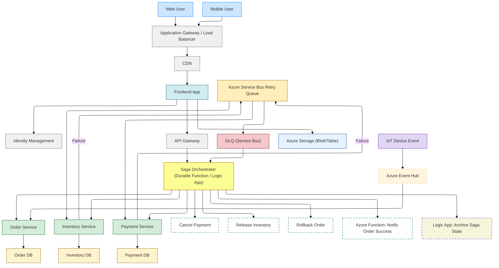

# Microservices Saga Orchestration

```mermaid
---
config:
  theme: base
  look: classic
  layout: elk
---
flowchart TD
    %% Users
    A1["Web User"]:::user
    B1["Mobile User"]:::user
    A2["Application Gateway / Load Balancer"]:::infra
    C1["CDN"]:::infra
    C2["Frontend App"]:::frontend
    D1["Identity Management"]:::infra
    D2["API Gateway"]:::infra

    %% Orchestrator
    ORC["Saga Orchestrator (Durable Function / Logic App)"]:::orchestrator

    %% Microservices
    OS["Order Service"]:::service
    IS["Inventory Service"]:::service
    PS["Payment Service"]:::service

    %% Databases
    ODB["Order DB"]:::db
    IDB["Inventory DB"]:::db
    PDB["Payment DB"]:::db

    %% Compensation Functions
    CF1["Cancel Payment"]:::function
    CF2["Release Inventory"]:::function
    CF3["Rollback Order"]:::function

    %% Retry/Failure Path
    RETRY["Azure Service Bus Retry Queue"]:::servicebus
    DLQ["DLQ (Service Bus)"]:::dlq

    %% Other Azure Components
    AF1["Azure Function: Notify Order Success"]:::function
    LA1["Logic App: Archive Saga State"]:::logicapp
    AZS["Azure Storage (Blob/Table)"]:::storage
    EH["Azure Event Hub"]:::eventhub
    IOT["IoT Device Event"]:::iot

    %% Frontend Path
    A1 --> A2
    B1 --> A2
    A2 --> C1
    C1 --> C2
    C2 --> D1
    C2 --> D2
    C2 --> AZS

    %% API to Orchestrator
    D2 --> ORC

    %% Saga Execution
    ORC --> OS
    OS --> ODB
    ORC --> IS
    IS --> IDB
    ORC --> PS
    PS --> PDB

    %% Success path
    ORC --> AF1
    ORC --> LA1

    %% Failure & Retry
    IS -- "Failure" --> RETRY
    PS -- "Failure" --> RETRY
    RETRY --> IS
    RETRY --> PS
    RETRY --> DLQ

    %% Compensation Actions
    DLQ --> ORC
    ORC --> CF1
    ORC --> CF2
    ORC --> CF3

    %% IoT + Event Ingestion
    IOT --> EH --> OS

    %% Styles
    classDef user fill:#cce5ff,stroke:#007bff,stroke-width:1px;
    classDef frontend fill:#d1ecf1,stroke:#0c5460,stroke-width:1px;
    classDef service fill:#d4edda,stroke:#155724,stroke-width:1px;
    classDef db fill:#fff3cd,stroke:#856404,stroke-width:1px;
    classDef orchestrator fill:#fdfd96,stroke:#c08400,stroke-width:1.5px;
    classDef servicebus fill:#ffeeba,stroke:#856404,stroke-width:1px;
    classDef dlq fill:#f5c6cb,stroke:#721c24,stroke-width:1px;
    classDef function fill:#fefefe,stroke:#198754,stroke-width:1.5px,stroke-dasharray: 5;
    classDef logicapp fill:#f5f5dc,stroke:#6f42c1,stroke-width:1.5px,stroke-dasharray: 5;
    classDef storage fill:#e6f2ff,stroke:#004085,stroke-width:1px;
    classDef iot fill:#e2d6f3,stroke:#5f259f,stroke-width:1px;
    classDef infra fill:#f0f0f0,stroke:#666,stroke-width:1px;
```
