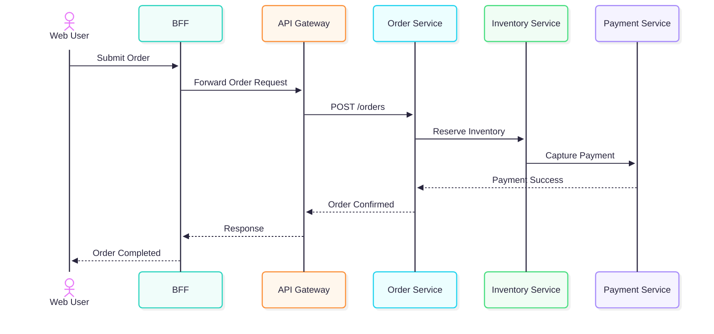

# Microservices Http Calls Sequence Diagram

```mermaid
---
config:
  theme: redux-color
  look: neo
---
sequenceDiagram
    actor WebUser as Web User
    participant BFF as BFF
    participant API_Gateway as API Gateway
    participant Order_Service as Order Service
    participant Inventory_Service as Inventory Service
    participant Payment_Service as Payment Service

    WebUser->>BFF: Submit Order
    BFF->>API_Gateway: Forward Order Request
    API_Gateway->>Order_Service: POST /orders
    Order_Service->>Inventory_Service: Reserve Inventory
    Inventory_Service->>Payment_Service: Capture Payment
    Payment_Service-->>Order_Service: Payment Success
    Order_Service-->>API_Gateway: Order Confirmed
    API_Gateway-->>BFF: Response
    BFF-->>WebUser: Order Completed
```
