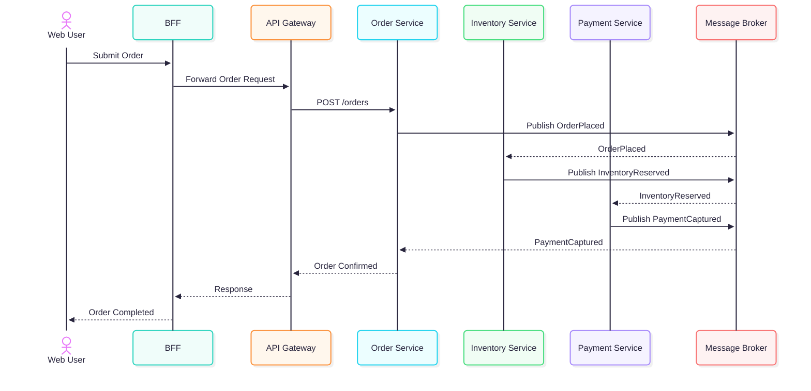

# Microservices Message Broker Sequence Diagram

```mermaid
---
config:
  theme: redux-color
  look: neo
---
sequenceDiagram
    actor WebUser as Web User
    participant BFF as BFF
    participant API_Gateway as API Gateway
    participant Order_Service as Order Service
    participant Inventory_Service as Inventory Service
    participant Payment_Service as Payment Service
    participant Message_Broker as Message Broker

    WebUser->>BFF: Submit Order
    BFF->>API_Gateway: Forward Order Request
    API_Gateway->>Order_Service: POST /orders
    Order_Service->>Message_Broker: Publish OrderPlaced
    Message_Broker-->>Inventory_Service: OrderPlaced
    Inventory_Service->>Message_Broker: Publish InventoryReserved
    Message_Broker-->>Payment_Service: InventoryReserved
    Payment_Service->>Message_Broker: Publish PaymentCaptured
    Message_Broker-->>Order_Service: PaymentCaptured
    Order_Service-->>API_Gateway: Order Confirmed
    API_Gateway-->>BFF: Response
    BFF-->>WebUser: Order Completed
```
