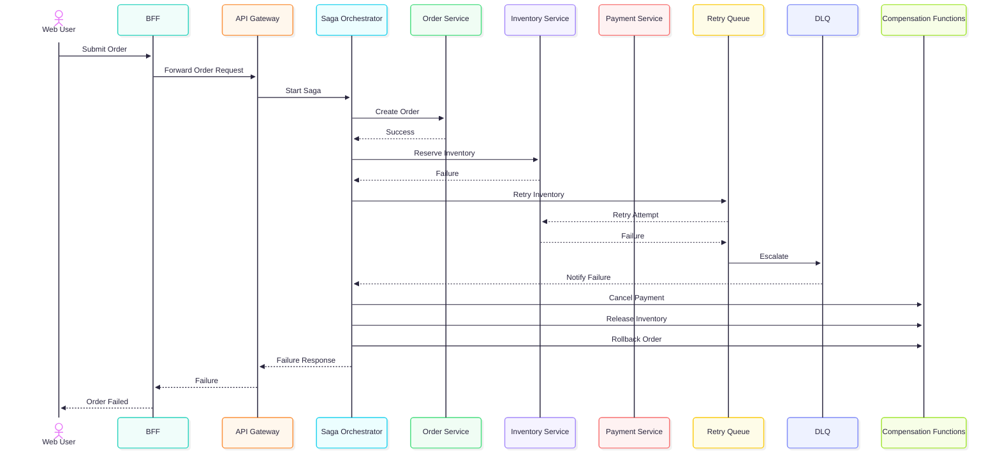

# Microservices Saga Orchrestation Sequence Diagram

```mermaid
---
config:
  theme: redux-color
  look: neo
---
sequenceDiagram
    actor WebUser as Web User
    participant BFF as BFF
    participant API_Gateway as API Gateway
    participant Saga_Orchestrator as Saga Orchestrator
    participant Order_Service as Order Service
    participant Inventory_Service as Inventory Service
    participant Payment_Service as Payment Service
    participant Retry_Queue as Retry Queue
    participant DLQ as DLQ
    participant Compensation_Functions as Compensation Functions

    WebUser->>BFF: Submit Order
    BFF->>API_Gateway: Forward Order Request
    API_Gateway->>Saga_Orchestrator: Start Saga

    Saga_Orchestrator->>Order_Service: Create Order
    Order_Service-->>Saga_Orchestrator: Success

    Saga_Orchestrator->>Inventory_Service: Reserve Inventory
    Inventory_Service-->>Saga_Orchestrator: Failure

    Saga_Orchestrator->>Retry_Queue: Retry Inventory
    Retry_Queue-->>Inventory_Service: Retry Attempt
    Inventory_Service-->>Retry_Queue: Failure
    Retry_Queue->>DLQ: Escalate

    DLQ-->>Saga_Orchestrator: Notify Failure
    Saga_Orchestrator->>Compensation_Functions: Cancel Payment
    Saga_Orchestrator->>Compensation_Functions: Release Inventory
    Saga_Orchestrator->>Compensation_Functions: Rollback Order

    Saga_Orchestrator-->>API_Gateway: Failure Response
    API_Gateway-->>BFF: Failure
    BFF-->>WebUser: Order Failed
```
