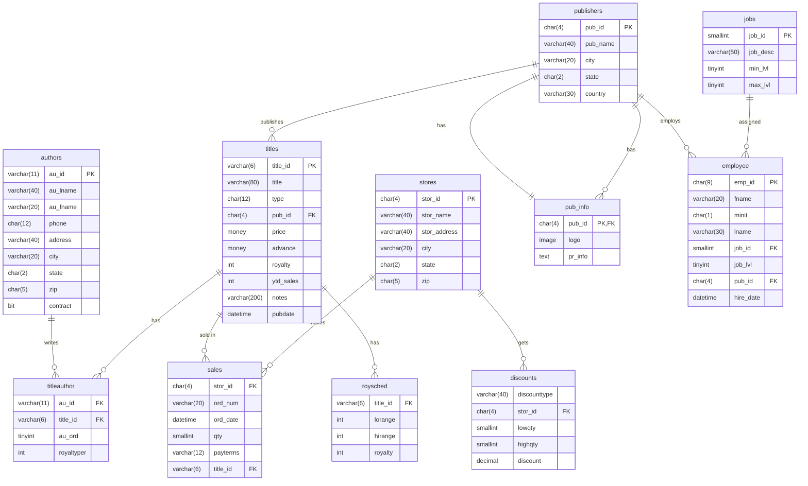

# Pubs Entity Relationship Diagram

```mermaid
erDiagram
    authors {
        varchar(11) au_id PK
        varchar(40) au_lname
        varchar(20) au_fname
        char(12) phone
        varchar(40) address
        varchar(20) city
        char(2) state
        char(5) zip
        bit contract
    }
    publishers {
        char(4) pub_id PK
        varchar(40) pub_name
        varchar(20) city
        char(2) state
        varchar(30) country
    }
    titles {
        varchar(6) title_id PK
        varchar(80) title
        char(12) type
        char(4) pub_id FK
        money price
        money advance
        int royalty
        int ytd_sales
        varchar(200) notes
        datetime pubdate
    }
    titleauthor {
        varchar(11) au_id FK
        varchar(6) title_id FK
        tinyint au_ord
        int royaltyper
        %% Composite PK: (au_id, title_id)
    }
    stores {
        char(4) stor_id PK
        varchar(40) stor_name
        varchar(40) stor_address
        varchar(20) city
        char(2) state
        char(5) zip
    }
    sales {
        char(4) stor_id FK
        varchar(20) ord_num
        datetime ord_date
        smallint qty
        varchar(12) payterms
        varchar(6) title_id FK
        %% Composite PK: (stor_id, ord_num, title_id)
    }
    roysched {
        varchar(6) title_id FK
        int lorange
        int hirange
        int royalty
    }
    discounts {
        varchar(40) discounttype
        char(4) stor_id FK
        smallint lowqty
        smallint highqty
        decimal discount
    }
    jobs {
        smallint job_id PK
        varchar(50) job_desc
        tinyint min_lvl
        tinyint max_lvl
    }
    pub_info {
        char(4) pub_id PK, FK
        image logo
        text pr_info
    }
    employee {
        char(9) emp_id PK
        varchar(20) fname
        char(1) minit
        varchar(30) lname
        smallint job_id FK
        tinyint job_lvl
        char(4) pub_id FK
        datetime hire_date
    }

    authors ||--o{ titleauthor : "writes"
    titles ||--o{ titleauthor : "has"
    publishers ||--o{ titles : "publishes"
    titles ||--o{ sales : "sold in"
    stores ||--o{ sales : "makes"
    titles ||--o{ roysched : "has"
    stores ||--o{ discounts : "gets"
    publishers ||--|| pub_info : "has"
    publishers ||--o{ employee : "employs"
    jobs ||--o{ employee : "assigned"
    publishers ||--o{ pub_info : "has"
```
